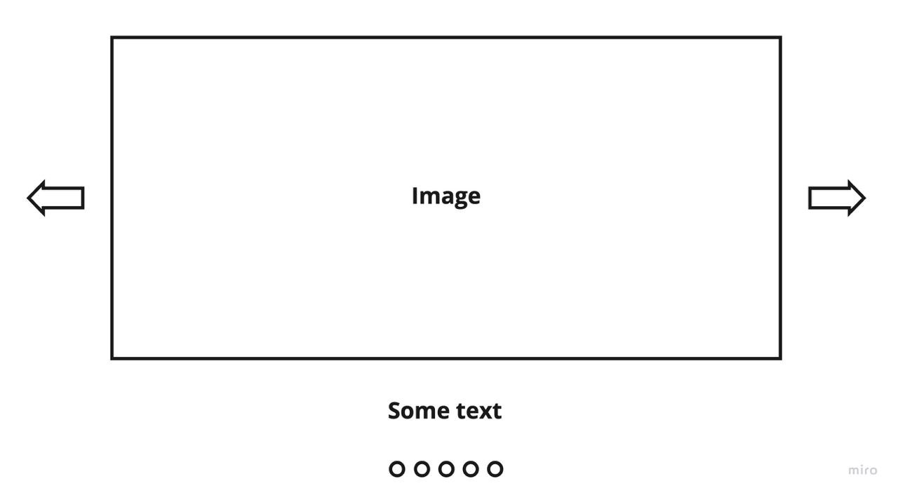

# Red Collar Frontend School 2023, Homework №6. React and state managers.

Необходимо реализовать кастомный слайдер ( естественно без подключения сторонних библиотек )

Требования:
  1. Изображения для слайдера можно или получать по запросу, или обращаться к статичным изображениям
1. Показывать описание или заголовок для каждого изображения.
 2. Навигация между слайдами с помощью стрелок.
 3. Навигация на мобильных устройствах с помощью тача
 4. Автопроигрывание для слайдера ( например, при нажатии на какую-нибудь кнопку происходит проигрывание слайдов в автоматическом режиме, когда слайды закончатся снова происходит показ первого слайда и так по кругу )
 5. Слайдер должен быть респонсив.

По технологиям:
- Использовать React
- Функциональное программирование
- SCSS
- При желании state-manager на выбор (рекомендую все же посмотреть в сторону effector)
- Дизайн: на усмотрение исполнителя

 Должно использоваться какое-то ограниченное количество слайдов ( например, 10 ) и пусть их количество отображается в точках ниже ( как на картинке ), активный слайд - заполненная точка, все остальные точки пустые, только обводка.

